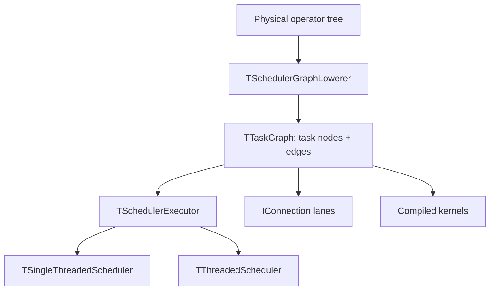
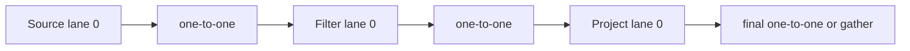
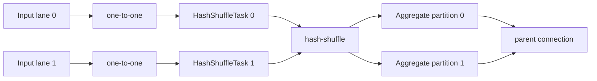
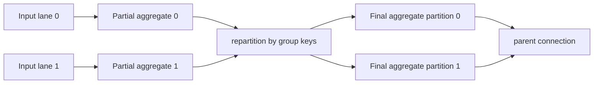
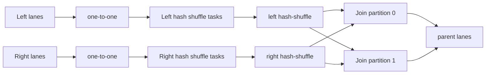
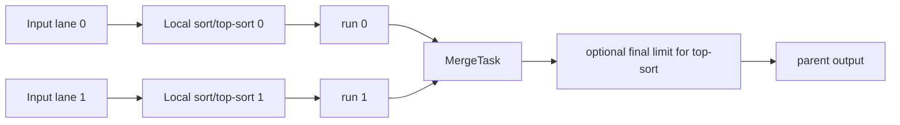

# Scheduler Runtime Architecture

This document describes the current scheduled physical runtime: how physical
operators lower into task nodes, which connections move batches between nodes,
and which compiled kernels each node uses. It is meant as a quick map for
evaluating whether a JavaScript runtime can drive the same graph while keeping
the kernels compiled in C++/WASM.

## Runtime Layers



The lowerer turns a typed physical operator tree into a graph of small runtime
tasks. Tasks own C++ state and call shared `*Code` objects. Connections are the
only data transport between tasks; they carry `TRowSet` batches and finish
signals.

The scheduler itself does not know SQL semantics. It only executes task nodes
and reschedules their neighbors when a task returns `OK`, `NEED_DATA`,
`BLOCKED_OUTPUT`, or `FINISHED`.

## Task Nodes

| Task node | Input shape | Output shape | Used by physical nodes | State owner | Why it exists |
|---|---|---|---|---|---|
| `TSourceTask` | none | one lane | `Source` | `TSchedulerSourceState` | Pulls rowsets from `ISource`; parquet scans can be split into independent row-group range sources. |
| `TUnaryTask` | one lane | one lane | `Filter`, `Project`, cross residual filter, cross scalar forwarding | `TUnaryStreamingKernelState` or trivial state | Streaming one-rowset-in/one-rowset-out stage. Keeps partitioning unchanged. |
| `TBlockingTask` | one lane | one lane | `Aggregate`, `Limit`, `Sort`, `TopSort` | operator-specific processor state | Drains input until enough state exists to emit output. |
| `TBinaryBlockingTask` | two lanes | one lane | equi-join, cross join | `TInnerJoinProcessor` or `TCrossJoinProcessor` | Coordinates two input streams and emits joined rowsets. |
| `TMergeTask` | N lanes | one lane | partitioned `Sort`, partitioned `TopSort` | `TMergeProcessor` | Merges already sorted runs from local sort tasks. |
| `THashShuffleTask` | one lane | many lanes through `THashShuffleConnection` | grouped aggregate, window, and equi-join repartition | per-task hash scratch and output buffers | Computes row hashes and routes rows to partition lanes. |
| `TSinkTask` | one lane | none | final sink | caller-owned `ISink` alias | Writes final rowsets and releases them. |

## Task State Machines

Every task exposes one scheduler method:

```text
Execute() -> OK | NEED_DATA | BLOCKED_OUTPUT | FINISHED
```

The scheduler owns only the ready/reschedule protocol. The task owns the local
state machine and returns:

| Result | Meaning | Scheduler reaction |
|---|---|---|
| `OK` | The task made progress and may have more work immediately. | Schedule the same task and its downstream tasks. |
| `NEED_DATA` | The task cannot proceed until an input produces or finishes. | Schedule upstream tasks. |
| `BLOCKED_OUTPUT` | The task has output but the downstream queue is full. | Schedule downstream tasks. |
| `FINISHED` | The task is done and has signalled output finish if it has output. | Mark done and schedule downstream tasks. |

### Generic Task Machines

| Task node | Persistent state | Main transition loop | Output ownership |
|---|---|---|---|
| `TSourceTask` | `Finished` flag, source state | If output cannot accept, return `BLOCKED_OUTPUT`; otherwise call `Source->Next(rowSet)`. On data, push rowset and return `OK`; on EOF, finish output and return `FINISHED`. | Source returns an owned/refcounted `TRowSet`; task transfers it to the output connection. |
| `TUnaryTask` | current input rowset, `HasInput`, `InputFinished`, `OutputFinished`, unary state | Fetch one input if none is held. On `NO_DATA`, return `NEED_DATA`; on input finish, finish output. Otherwise run `Code.Process(state,rowSet)`, push transformed rowset, return `OK`. | Holds one input rowset across retries; releases it in destructor if still held. |
| `TSinkTask` | `Finished` flag, sink alias | Fetch one input. On `NO_DATA`, return `NEED_DATA`; on finish, return `FINISHED`; on rowset, call sink writer, release rowset, return `OK`. | Consumes and releases fetched rowsets. |
| `TBlockingTask` | pending output rowset, `HasOutput`, `OutputFinished`, blocking processor state | First flush pending output if any. Then call `Code.Process(state,input,output)`. If processor returns `OK`, remember output and return `OK`; if `FINISHED`, finish output. | Processor fills one output rowset at a time; task owns pending output until pushed. |
| `TBinaryBlockingTask` | pending output rowset, `HasOutput`, `OutputFinished`, binary processor state | Same as `TBlockingTask`, but calls `Code.Process(state,left,right,output)` and the processor drives two input ports. | Same pending-output ownership as blocking task. |
| `TMergeTask` | pending output rowset, `HasOutput`, `OutputFinished`, merge state and input ports | Same pending-output shell as blocking task; processor reads all run inputs, then emits merged rowsets. | Same pending-output ownership as blocking task. |
| `THashShuffleTask` | hash buffer, per-destination buffers, pending rowsets, pending index, `OutputFinished` | Push pending outputs first. Otherwise fetch input; on data, hash/scatter into destination buffers and push ready outputs; on input finish, flush all buffers, push pending, finish the source lane. | Either emits selection-view rowsets retaining the input, or materialized rowsets with owned buffers. |

### Operator Processor Machines

These are the SQL-level machines currently hidden behind generic task nodes.
For a JS runtime, each row in this table is either JS code or a native/WASM node
adapter.

| Physical node | Generic task | Processor state | State machine | Compiled kernels used |
|---|---|---|---|---|
| `Filter` | `TUnaryTask` | reusable selection buffer | For each rowset, resize selection, point `rowSet.Selection` at it, call filter dispatch, then detach selection before crossing a connection. | `CompileFilter` |
| `Project` | `TUnaryTask` | none beyond closure metadata | For each rowset, retain input, allocate owned buffers for computed columns, call project dispatch, build output column array mixing input columns and computed columns. | optional `CompileProject` |
| `Limit` | `TBlockingTask` | skipped/emitted counters | Fetch rowsets until enough rows are skipped/emitted; produce selection-view rowsets; finish when limit reached or input finishes. | none |
| `Aggregate` | `TBlockingTask` | aggregate hash table, done flag, output buffers inside processor | On first use init hash table; for each input rowset call update dispatch; on EOF measure groups, allocate output buffers, call finalize, emit output, then finish/destroy. | aggregate dispatch/measure/finalize |
| `Sort` | `TBlockingTask` | row store, row-id vector, cursor, optional radix scratch | Drain all input rowsets into row store; sort row ids by keys; emit gathered output batches by cursor. | optional radix sort dispatch |
| `TopSort` | `TBlockingTask` | bounded top-K state, scratch buffers, cursor | For each input rowset, keep only local top-K candidates; after EOF emit gathered sorted top-K batches. | optional radix sort dispatch |
| `Merge` | `TMergeTask` | one row store per run, finished flags, merged row-id vector, cursor | Drain all sorted run inputs; merge run row ids by the same sort comparator; emit gathered output batches. | none directly; local sorts may use radix kernels |
| Equi-join | `TBinaryBlockingTask` | left/right row stores, two hash tables, pair buffer, ready output queue, join mode flags | Fetch from both sides, store batches, call process-left/right kernels, drain pair buffer into output rowsets; after one side finishes, stream/probe or finalize depending on join type. | join init/process/probe/finalize/destroy kernels |
| Cross join | `TBinaryBlockingTask` | right row store, optional left row store, output builder, drain flags | Drain/buffer right side, then stream left rowsets and pair each selected left row with every buffered right row; residual is a separate filter stage. | none for cross itself; residual uses filter kernel |
| Hash shuffle | `THashShuffleTask` | hash scratch, per-partition buffered row lists, pending outputs | For each input rowset, compute row hashes, route selected rows to partitions, flush partition buffers by row/byte thresholds, materialize when needed. | join hash or group hash |

### Single-threaded One-to-one Subset

If the exported graph is restricted to single-threaded execution and
`TOneToOneConnection`, the scheduler-side machines shrink to a direct
producer/consumer loop:

```text
while root not finished:
    run scheduled task
    task fetches from its one input lane
    task pushes to its one output lane
```

In that subset, no JS runtime support is needed for `TGatherConnection`,
`THashShuffleConnection`, `TBroadcastConnection`, worker queues, atomics, or
partition lane fan-out. The remaining work is exactly the operator processor
machines above: either implement them in JS over exported `TRowSet` memory, or
expose each processor as a WASM node adapter with `push/finish/next/destroy`.

## Connections

| Connection | Cardinality | Fetch behavior | Used for | Cost model |
|---|---:|---|---|---|
| `TOneToOneConnection` | N -> N | destination `i` reads source `i` | normal streaming edges, single-lane blocking input, single-lane final output | Cheapest connection; preserves partitioning. |
| `TGatherConnection` | N -> 1 | one destination round-robins over source lanes until all finish | global blocking operators, final output with multiple lanes, scalar side gather | Serializes lanes; useful only when semantics require one consumer. |
| `THashShuffleConnection` | N -> M | destination `j` reads from every source lane routed to partition `j` | grouped aggregate, window, and equi-join partitioning | Expensive boundary: hash kernel, routing, buffering/materialization. Carries the repartition key contract; `DstCount()` is the partition count. |
| `TBroadcastConnection` | 1 -> N | every destination receives a shared copy | cross join scalar side | Replicates small scalar-side batches to each vector lane. |

Every connection is made of bounded rowset queues plus finish state. The graph
stores edges with `(connection, srcLane, dstLane)` so diagnostics can print the
same logical connection between multiple task pairs.

`THashShuffleConnection::Repartition()` returns the physical
`TRepartitionSpec`. The spec has the column names for the hash kernel. A task
routes each row. The connection states which partition rule the task uses.

## Compiled Kernels

| Kernel bundle | Compiler entry | ABI shape | Called by | Purpose |
|---|---|---|---|---|
| Filter | `CompileFilter` | `void(TRowSet&)` | `TUnaryTask` via `MakeFilterProcess` | Fill `rowSet.Selection` for one input batch. |
| Project | `CompileProject` | `void(TRowSet*, void** outBuffers)` | `TUnaryTask` via `MakeProjectProcess` | Compute non-identity projection columns; identity columns stay zero-copy references. |
| Aggregate | `CompileAggregate` | `Dispatch(ht,batch,arg,op)`, `Measure`, `Finalize` | `TBlockingTask` through `TAggregateProcessor` | Maintain per-group hash table and emit grouped aggregate output. |
| Join | `CompileJoin` | init, process-left/right, stream-probe, finalizers, destroy | `TBinaryBlockingTask` through `TInnerJoinProcessor` | Symmetric hash join, semi/anti, outer finalization, residual filtering inside join kernel where supported. |
| Join hash | `CompileJoinHash` | `bool(TRowSet*, uint64_t*)` | `THashShuffleTask` | Compute one hash per physical row for join-side partitioning. |
| Group hash | `MakeGroupKeyHash` | `bool(TRowSet*, uint64_t*)` | `THashShuffleTask` | Compute one hash per physical row for grouped aggregate partitioning. |
| Sort radix | `CompileRadixSortComposite`, `CompileRadixSortCompositeNullable` | key arrays + index/work/count buffers | `TSortProcessor`, `TTopSortProcessor` | Fast index sorting for radix-sortable key columns. |

The important ownership split is:

| Layer | Owns | Does not own |
|---|---|---|
| Compiled kernel | row-level/vector-level computation over `TRowSet` ABI and caller buffers | scheduling, queues, graph state, scan/sink lifetime |
| Task code | call order, `TRowSet` retention/release, processor transitions | thread scheduling and ready queue policy |
| Connection | rowset transport and finish propagation | SQL semantics |
| Scheduler | choosing which task runs next | rowset interpretation and kernel internals |

## Operator Lowering

| Physical operator | Lowered task pattern | Connections | Kernels/processors | Notes |
|---|---|---|---|---|
| `Source` | one `TSourceTask` per scan lane | parent output connection | none | Parquet source may split row groups into several lane-local sources. |
| `Filter` | child lanes -> `TUnaryTask` per lane | `one-to-one` child input | filter kernel | Selection is detached before crossing the output connection. |
| `Project` | child lanes -> `TUnaryTask` per lane | `one-to-one` child input | optional project kernel | Identity columns are references; computed columns are materialized into owned buffers. |
| `Limit` | child -> one `TBlockingTask` | `one-to-one` if one child lane, otherwise `gather` | `TLimitProcessor` | Global limit/offset is intentionally single-lane. |
| `Aggregate`, ungrouped/global | child -> one aggregate task, or optional cascade | `one-to-one` or `gather`; cascade uses partial tasks -> `gather` -> combine task | aggregate kernels | Cascade is off by default for cheap aggregates. |
| `Aggregate`, grouped | either child lanes -> repartition -> complete aggregate, or statistics-selected local partial aggregate -> repartition -> final aggregate | `one-to-one` into each local phase, `hash-shuffle` at the repartition boundary | group hash + partial/final aggregate kernels | Partial and final are distinct executable stages. Parent usually gathers final partitions later if needed. |
| `Sort`, one input lane | child -> one sort task | `one-to-one` | sort processor + optional radix kernel | Full blocking sort. |
| `Sort`, many input lanes | local sort per lane -> merge task | `one-to-one` run connections | local sort + merge processor | Produces one globally sorted stream. |
| `TopSort`, one input lane | child -> one top-sort task | `one-to-one` | top-sort processor + optional radix kernel | Keeps local top-K only. |
| `TopSort`, many input lanes | local top-sort per lane -> merge -> limit | `one-to-one` run connections | top-sort + merge + limit | Implements `top-sort over partitions -> merge -> limit`. |
| Equi-join, single partition | left/right -> one binary join task | two `one-to-one` inputs | join kernels | Fast path skips hash-shuffle and join-hash kernels. |
| Equi-join, partitioned | left/right -> shuffle tasks -> join task per partition | two `one-to-one` inputs, two `hash-shuffle` connections | join hash + join kernels | Both sides use the same partition count, so matching keys land in the same join lane. |
| Keyless inner join | vector side + scalar side -> cross tasks | vector `one-to-one`; scalar `one-to-one` or `gather -> broadcast` | `TCrossJoinProcessor`; residual uses filter kernel | Scalar side is buffered, then paired with each vector lane. |
| Final sink | producers -> `TSinkTask` | `one-to-one` if one lane, otherwise `gather` | none | `RunPlanIntoSink` appends the sink node after lowering. |

## Common Graph Shapes

### Streaming unary pipeline



The scheduler dispatches tasks, but filter/project semantics live in
`TUnaryCode`. A JS runtime would need to implement this task and connection
protocol; the filter/project computation can stay in WASM kernels.

### Grouped aggregate without local reduction



The shuffle computes hashes first, then either emits selection-view rowsets or
materializes accumulated rows when batching crosses the configured thresholds.
Aggregate tasks own separate hash table state; compiled aggregate kernels are
shared.

### Grouped aggregate with local reduction



The scheduler selects this plan only when the input has at least 1,048,576
rows. Statistics must also show at least 8x fewer groups than rows. Each partial
lane builds local groups before it sends rows to the exchange. The final phase
merges partial states. It changes `count` to `sum`. It keeps `sum`, `min`, and
`max` as they are. All lanes in one phase use the same compiled code object.

The executable plan marks the stages as `partial` and `final`. The hash-shuffle
connection between them stores the group keys in `TRepartitionSpec`. The plan
does not hide this fact in task names.

### Partitioned equi-join



Each join partition owns its own `TInnerJoinProcessor`, two hash tables and row
stores. The compiled join kernels are shared between partition states.

### Partitioned sort / top-sort



Merge is currently a C++ processor over sorted row-id runs. The radix sort
kernel accelerates local sorting when all keys are supported.

## JavaScript/WASM Runtime Boundary

The current graph is already close to a portable dispatcher model: graph
topology, task kind, connection kind, lane ids, and kernel handles are explicit.
The remaining C++ coupling is mostly in task state and rowset lifetime helpers.

### Border for a distributed scheduler

The task graph is the physical plan for worker placement. The browser exec plan
hides route tasks, so it is not the worker placement plan. A distributed
scheduler can use these steps:

1. Put source, unary, and partial aggregate task groups on workers.
2. Read the keys from `TRepartitionSpec`.
3. Read the partition count from the destination lane count.
4. Assign destination lanes to workers.
5. Send `TRowSet` batches over a network connection with the same
   push/fetch/finish rules.
6. Run final aggregate task groups. Each partition has its own state.

`BuildAggregateCombineOperator` creates the final aggregate. This rule does not
belong to a scheduler. The exec plan also has `Single`, `Partial`, and `Final`
aggregate phases. A distributed scheduler still needs a wire format, flow
control, error recovery, and a placement policy. It does not need to find the
aggregate keys again or change a single aggregate after worker placement.

| Runtime piece | JS can own today in principle | Requires C++/WASM adapter | Why |
|---|---|---|---|
| Graph topology | yes | no | Nodes, edges, lanes and debug names are plain structural data. |
| Scheduling policy | yes | no | Scheduler consumes only task results and graph edges. |
| `OneToOne` / `Gather` / `Broadcast` queues | yes | maybe | Semantics are simple rowset queues plus finish flags. Need exact `TRowSet` ownership ABI. |
| `HashShuffleConnection` | yes | yes | Queue semantics are simple, but shuffle task currently performs C++ selection/materialization. |
| Source task | partial | yes | Parquet scan and `ISource` are C++ objects today. JS can schedule it, but scan implementation remains native/WASM. |
| Filter/project task | yes | yes | JS can call WASM kernels and manage rowset buffers if `TRowSet` ownership is exported. |
| Aggregate task | partial | yes | Dispatch/measure/finalize are kernels, but `TAggregateProcessor` owns hash table lifecycle and output assembly in C++. |
| Join task | partial | yes | Kernels are compiled, but row stores, pair buffer draining, outer/semi finalization orchestration and materialization are C++. |
| Sort/merge/top-sort task | partial | yes | Radix kernels are compiled, but row store, comparator fallback, merge and output gather are C++. |
| Sink task | yes | maybe | Depends on the target sink; null/text sinks are simple, external sinks need adapters. |

The architectural blocker is not kernel dispatch: the compiled kernel handles
are already separated from scheduler task execution. The blocker is that several
operator processors still combine three responsibilities in C++:

1. Stateful operator protocol (`Add`, `Finish`, `Next`, two-input fetch loops).
2. Rowset ownership and materialization (`Retain`/`Release`, private destroy
   payloads, selection detaching, string/nullable output assembly).
3. Calls into compiled kernels.

A JS runtime over WASM kernels becomes smooth when these state machines are
either exported as native/WASM operator adapters, or their data/state ABI is
made explicit enough for JS to own them directly.

## Current Dispatch Summary

| Category | Already kernelized | Still mostly C++ dispatch/state |
|---|---|---|
| Per-row expression evaluation | filter predicates, computed project columns, join residuals | selection ownership after filter |
| Hashing | join key hash, group key hash | shuffle routing, batching, materialization |
| Aggregation | hash table update/finalize kernels | processor lifecycle, output sizing/gather |
| Join | hash table probe/insert/finalizers | two-input pull policy, row stores, pair draining, output gather |
| Sort | radix key sorting for supported key types | comparator fallback, row store, merge, top-K state |
| Scan/sink | none in scheduler kernels | source/sink implementations |

This means a JS scheduler can be designed around the current graph model, but a
pure JS dispatcher would still need exported native adapters for aggregate,
join, shuffle materialization and sort/merge unless those state machines are
split into explicit ABI objects.
